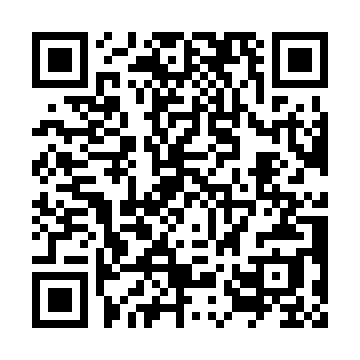
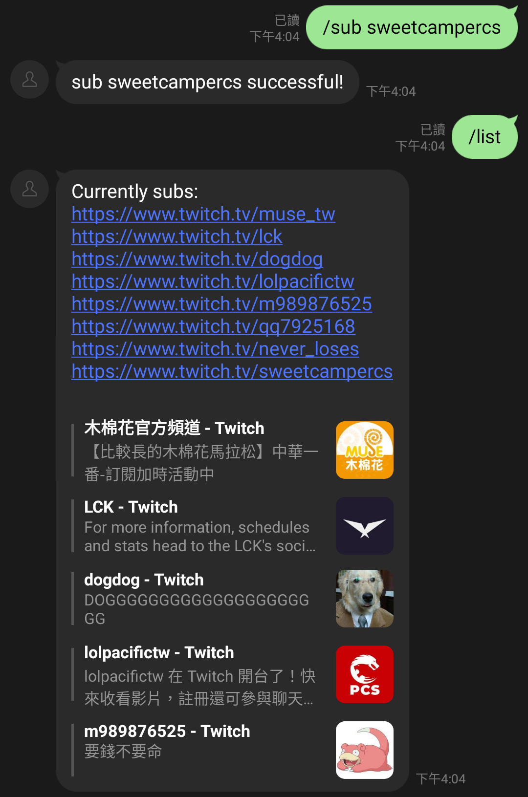
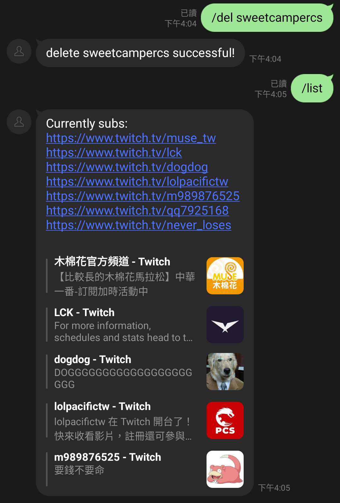
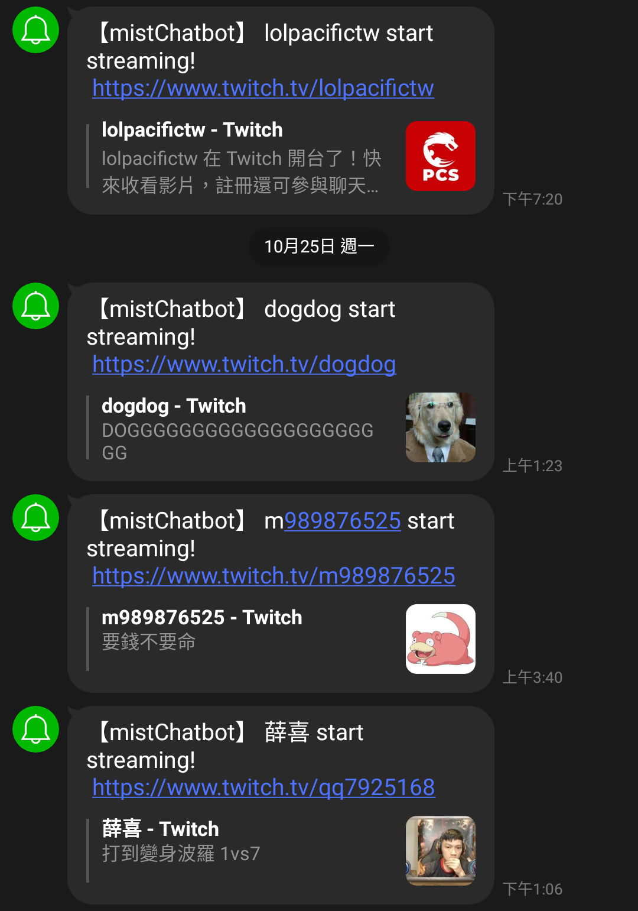
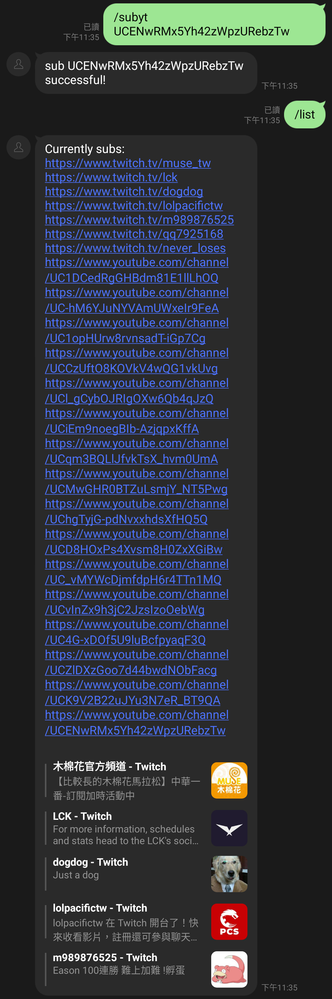
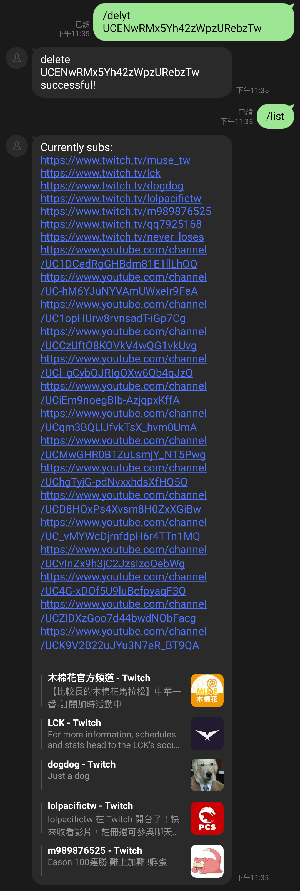
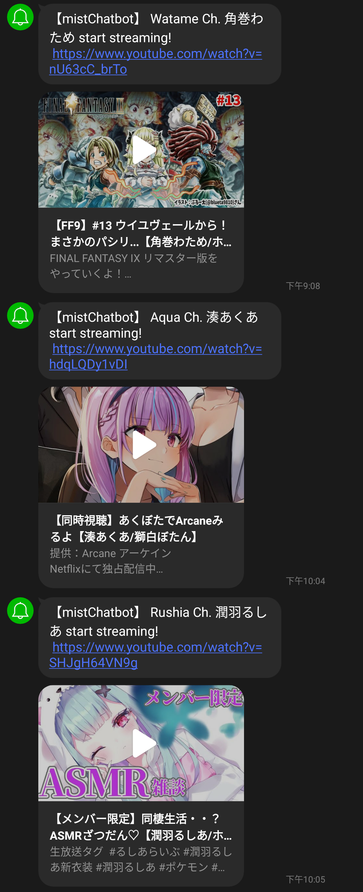

# mistbot - Twitch/YouTube 實況通知機器人

A line chatbot that send notification to you through LINE notify when a streamer go online.

## Line Usage

1. Add this account on Line : https://lin.ee/xeaZqKh or

   
3. Connect to Line notify by clicking the link mistbot provide to you after you add mistbot to your friend.
4. Now you can start and subscribe some channel !

## Basic bot command

All the chatbot command starting with "/" :
1. `/sub [Twitch ID]` : subscribe a channel
   * example: /sub never_loses
2. `/del [Twitch ID]` : delete a channel
   * example: /del qq7925168
3. `/subyt [YouTube ChannelID]` : subscribe a channel
   * example: /subyt UC1DCedRgGHBdm81E1llLhOQ
4. `/delyt [YouTube ChannelID]` : delete a channel
   * example: /delyt UC1DCedRgGHBdm81E1llLhOQ
5. `/list` : list all the channel that you subscribe

## Demo
| Subscribe Twitch channel           | Delete Twitch channel              | Notify message                      |
|------------------------------------|------------------------------------|-------------------------------------|
|  |  |  |

| Subscribe YouTube channel    | Delete YouTube channel       | Notify message                 |
|------------------------------|------------------------------|--------------------------------|
|  |  |  |

## TODO
- [ ] Automatically renew Twitch API token.
- [x] Integrate YouTube live stream.
